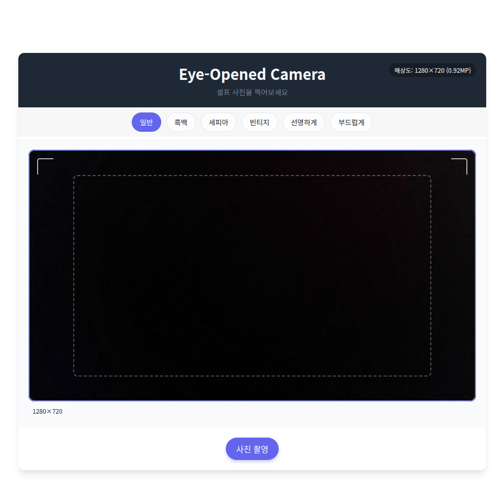

# 👁️‍🗨️ Eye-Opened 웹 어플리케이션

### 개요

웹캠(또는 동영상)으로 촬영한 얼굴에서 눈을 감았는지/떴는지 실시간으로 판별하고, 눈을 감은 경우 1초짜리 동영상을 분석하여 눈을 뜬 프레임을 추출하는 AI 기반 웹 서비스

### 주요 기능
- 웹캠 실시간 촬영 및 이미지 분석
- 눈 감음/뜸 상태 판별 (YOLOv8 얼굴 탐지 + CoAtNet 눈 상태 분류)
- 눈 감은 경우 1초 동영상 자동 녹화 및 분석
- 동영상에서 눈을 뜬 프레임만 추출해서 결과 제공
- 결과 이미지를 다운로드 가능
- 다양한 실시간 카메라 필터 제공 (흑백, 세피아 등)

### 기술 스택
- **Backend**  
  Flask, YOLOv8, timm(CoAtNet), torch, torchvision, OpenCV, PIL, imageio

- **Frontend**  
  HTML5, JavaScript (웹캠 & 필터), Fetch API

  
